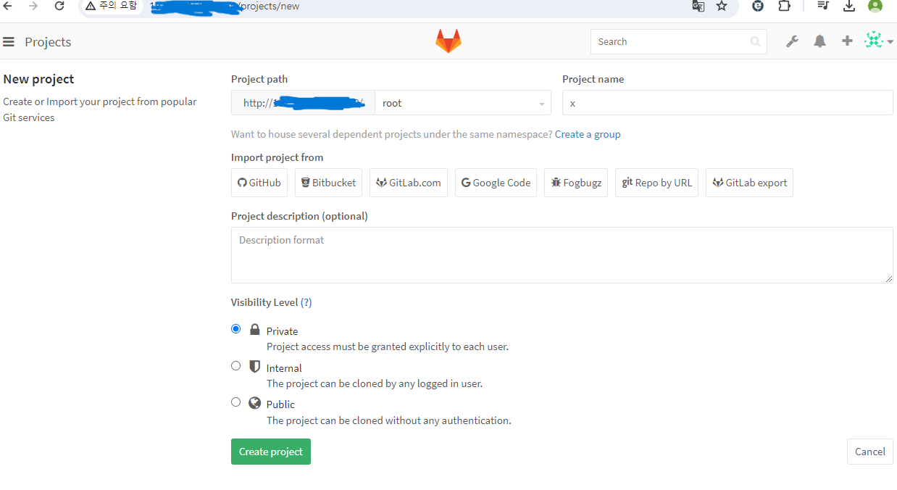
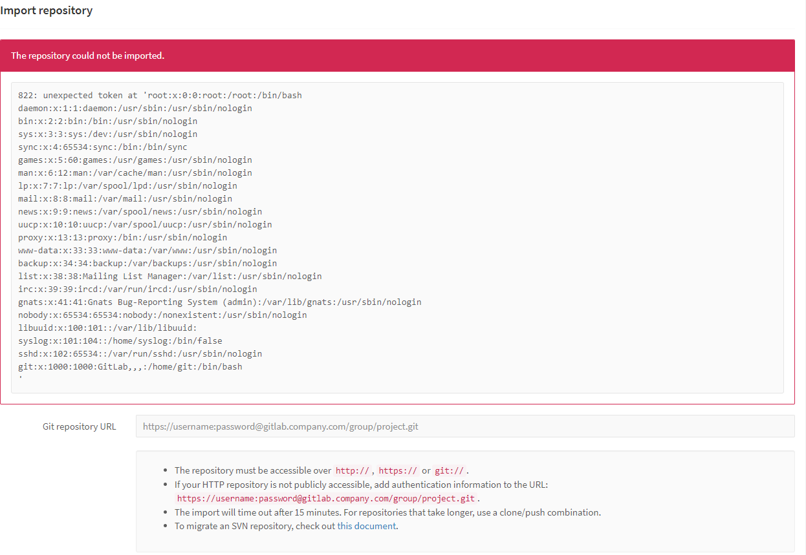

# CVE-2016-9086

> WHS2 24반 박재민(1150)

 

### 요약

- CVE-2016-9086은 GitLab 8.9.x 버전부터 8.13 버전까지 발견된 중요한 보안 취약점입니다.
- 이 취약점은 GitLab의 '프로젝트 가져오기/내보내기' 기능에서 발생했습니다.
- 공격자가 이 취약점을 악용하면 GitLab 서버에서 임의의 파일을 읽을 수 있습니다.

### 환경 구성 및 익스플로잇

-   git clone 명령어를 통하여 vulhub에 저장된 취약점 폴더들을 불러옵니다.
-   `docker compose up -d`를 실행하여 테스트 환경을 실행합니다
-   `http://제 아이피:8080/`에 접속합니다.
-   아이디 : root , 비밀번호 : vulhub123456을 입력한 후 로그인합니다.

-   New project를 눌러 다음과 같이 Project 이름을 작성후 GitLab Export 버튼을 클릭합니다.

-  그러면 파일을 불러올 수 있는데 여기서 test.tar.gz 파일을 불러옵니다.

- 익스플로잇 코드가 작성되어있는 test.tar.gz 파일을 불러옵니다.

- /etc/passwd 명령어가 실행된 것을 볼 수 있습니다.

